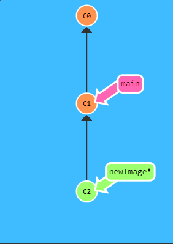

# Branch
Este comando se utiliza para crear ramas en git, una rama proviene de algun commit en especifico. por lo tanto no consume almacenamiento extra y ademas te permite trabajar en diferentes funcionalidades de cada proyecto.

## Crear Branch

Para crear una Branch se sigue la siguiente sintaxis

~~~
git branch nombre_rama
~~~

Como resultado te creara una nueva rama local y para cambiarte a esa nueva rama debes colocar.

~~~
git checkout nombre_rama
~~~

Asi finalmente estaras en tu nueva rama y no modificarias tu rama principal.

## Ejemplo Branch "NewImage" con Commit
