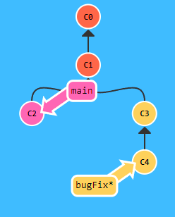
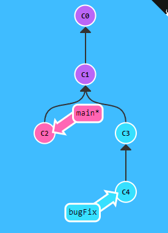
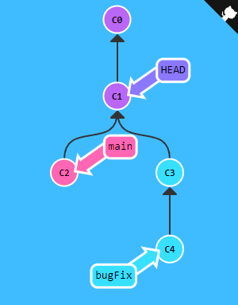

# Git Checkout

Este comando permite a los programadores desplazarse entre la linea temporal de los cambios en el proyecto.

Miren el siguiente ejemplo:

Aqui pueden observar que actualmente estoy en mi rama bugFix, pero quiero desplazarme la rama Main.

~~~
git checkout main
~~~

Me desplazará a la rama main.

Ahora vemos que el asterisco " * " se encuentra en main, haciendo referencia que estamos en main. Aunque tambien podemos movernos a un commit en especifico.

~~~
git checkout C1
~~~

