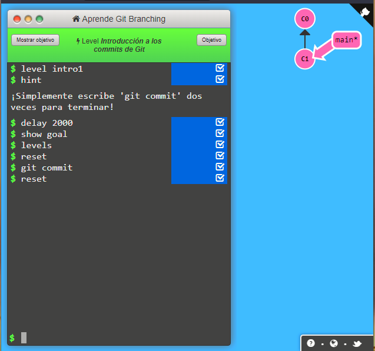
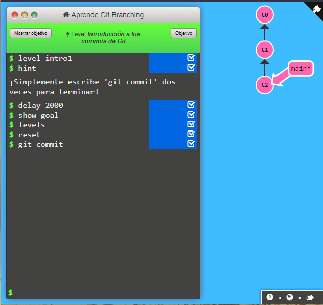

# Commit

Este comando se utiliza para guardar los cambios agregados anteriormente, es como marcar una epoca o etapa del codigo el cual se puede identificar mediante un codigo.

Este generalmente está acompañado de un add y se veria de la siguiente manera

~~~
git add .
git commit
~~~
## Antes del commit

## Despues del Commit

