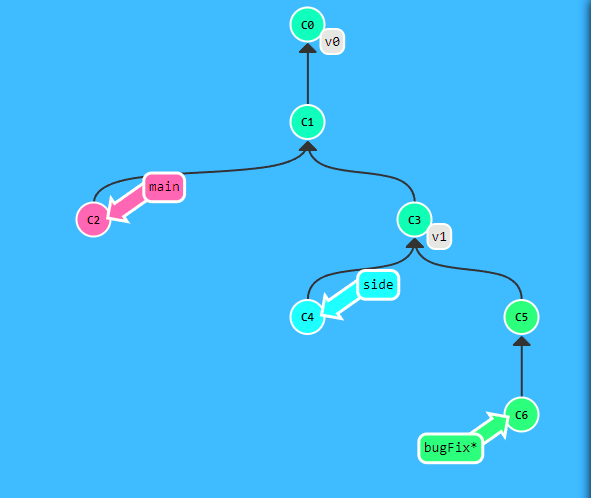

# Git describe

Este comando te ayuda a ubicarte dentro de la linea temporal de commits y ramas.

Este comando te devuelve un resultado con este formato

~~~
<tag mas cercano>_<distancia en commit de ese tag>_g<Commit en el que te encuentas>
~~~

Ejemplo:

~~~
<- git describe side
-> v1_1_gC4
~~~

