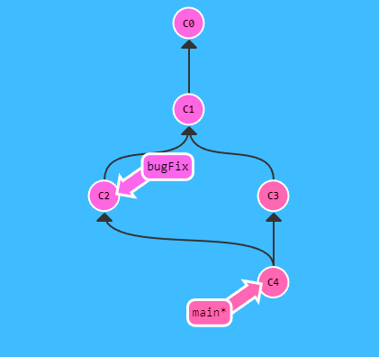

# Git Merge 
Es uno de los comandos mas comunes junto a Commit y branch. Se utiliza para unir 2 ramas  en el mismo camino. Eso significa la union automatica de 2 codigos.
## Problemas
A veces pueden entrar en conflicto 2 codigos si al intentar el merge, estos se modifican uno al otro. Generalmente no ocuree, pero en caso de que si, entonces una persona debe solucionar esos conflictos.

## Funcionamiento

Para funcionar debes estar colocado en la rama principal en la cual vas a realizar la union de codigo con git checkout. Luego ejecutas el siguiente comando.

~~~
git merge rama_A_unir
~~~

Las ramas comenzaran a unirse de la siguiente forma.

