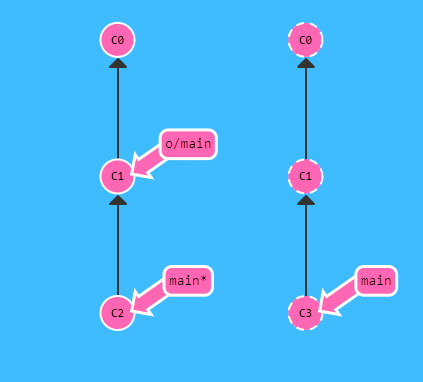
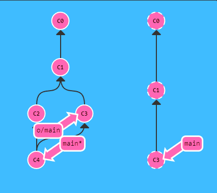

# Git Pull
Uno de los comandos mas utilizados, su proposito es bajar los cambios y unirlos con tus avances actuales.

En resumen hace lo mismo que un fetch y un merge, pero en un solo comando.

~~~
git pull
~~~

