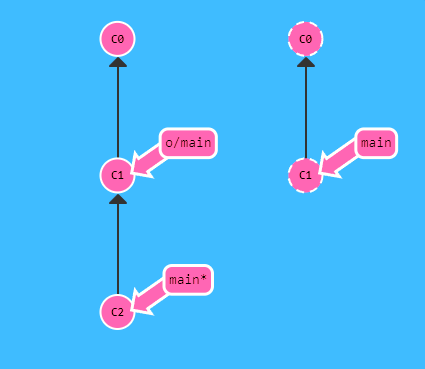
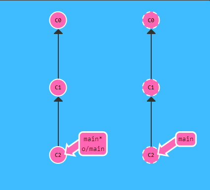

# Git Push

Es uno de los comandos mas utilizados, este envia tus cambios o commits locales al repositorio remoto. Utilizado para su posterior merge en la rama principal en caso de que este bloqueada.

~~~
git push
~~~

