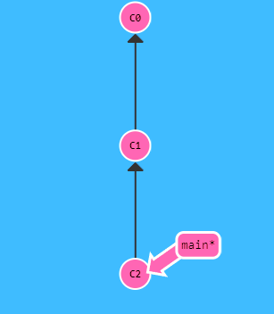
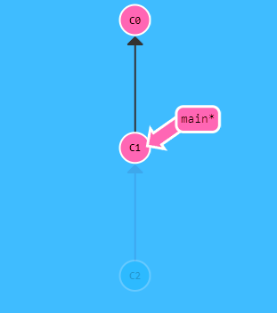

# Git Reset
Este comando vuelva a restablecer los cambios hasta una posicion o commit en especifico, en este caso partiremos de un commit C2 y volveremos al commit C1.

~~~
git reset HEAD~1
~~~

Con esto volvera a la posicion anterior y olvidandose del C2 como si nunca hubiera existido.

